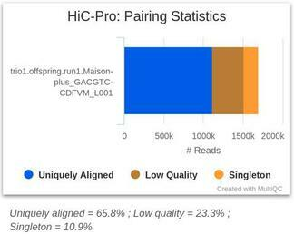

# PolledHiC

Table des matières
=================

* [PolledHiC](#polledhic)
* [Table des matières](#table-des-matières)
* [Introduction](#introduction)
   * [La méthode HiC](#la-méthode-hic)
   * [Les données SeqOccin](#les-données-seqoccin)
* [NF-Core/HiC](#nf-corehic)
   * [Workflow](#workflow)
   * [MultiQC](#multiqc)
   * [Tableau récapitulatif des données](#tableau-récapitulatif-des-données)
   * [Les matrices de contacts](#les-matrices-de-contacts)
* [Conda : polledHiC_env](#conda--polledhic_env)
* [hicExplorer](#hicexplorer)
   * [ConvertFormat](#convertformat)
   * [SumMatrices](#summatrices)
   * [AdjustMatrix](#adjustmatrix)
   * [Normalize et CorrectMatrix](#normalize-et-correctmatrix)
   * [Diagnostic plot](#diagnostic-plot)
   * [Carte HiC](#carte-hic)
   * [Recherche de TADs](#recherche-de-tads)
      * [hicFindTADs :](#hicfindtads-)
      * [hicPlotTADs :](#hicplottads-)
* [Snakemake et automatisation](#snakemake-et-automatisation)
   * [nfcore-hic](#nfcore-hic)
      * [nfcore-hic.config :](#nfcore-hicconfig-)
      * [nfcore-hic.sh :](#nfcore-hicsh-)
   * [hicexplorer](#hicexplorer-1)
      * [config.yaml :](#configyaml-)
      * [make_sampled_protocol.py :](#make_sampled_protocolpy-)
      * [Snakefile :](#snakefile-)
      * [hicexplorer.sh :](#hicexplorersh-)
* [TL;DR : Comment lancer une analyse sur Genologin](#tldr--comment-lancer-une-analyse-sur-genologin)

# Introduction

Le projet PolledHiC est un projet réalisé dans le cadre d'un stage facultatif de Master 1 Bioinformatique et Biologie des systèmes.

Il a été initié par Thomas FARAUT et Alain PINTON (INRAE Occitanie - UMR GenPhySE). 
L'objectif du projet polledHiC est d'étudier l'impact d'une duplication (~100kb), associée au phénotype sans corne chez le bovin, sur l'organisation tridimensionnelle des chromosomes dans le noyau. On cherche plus précisément à savoir si c'est via une modification de l'organisation 3D que la mutation (duplication) produit le péhnotype sans corne.

Le projet consiste à traiter les données de séquençage HiC de l'équipe de SeqOccin pour tenter d'obtenir des cartes chromosomiques de différentes régions d’intérêts chez les bovins. 
Le but __du stage__ est de fournir un pipeline permettant l'analyse et la comparaison des structures tri-dimensionnelle entre les phénotypes 'avec cornes' et 'sans cornes' chez certains d'entre eux.

## La méthode HiC

La méthode de séquençage HiC ( High Chromosome Contact map ), est une technique de séquençage haut débits permettant d'étudier les interactions entre régions chromosomiques.


Les étapes sont les suivantes :


* Cross-link pour 'figer' les chromosomes.
* Digestion par des enzymes de restrictions.
* Ligation des fragments cross-linker.
* Élimination du 'cross-link'
* Filtrage des séquences sur les régions d'intérêt
* Visualisation (cartes HiC et plot TADs)

## Les données SeqOccin

Les données ont été obtenus par le biais du projet « **Séquençage Occitanie Innovation** » (soit SeqOccin). 

Elles contiennent les informations de deux trio de bovins pour lesquels ont été réalisés :

- différents protocoles HiC (Arima, Dovetail, PhaseG et et un protocole maison).
- différents runs avec différente couverture.

Dans le cadre de ce projet, les protocoles PhaseG n'ont pas été retenus.

# NF-Core/HiC

Le pipeline **[NF-Core/HiC](https://github.com/nf-core/hic)** est basé sur le workflow HiC-Pro. Il permet d'obtenir des matrices de contacts à partir de données brutes au format FastQ.

A l'issue de ces étapes, les manipulations sur les matrices de contacts seront réalisés via le logiciel [HiCExplorer](https://github.com/deeptools/HiCExplorer).

## Workflow

Le workflow de NF-Core/hic se réalise en X étapes :

1. Alignements des reads
2. Appariements des reads
3. **Mapping**
4. Obtention de la matrice de contacts brut


Au cours de ce pipeline, l'étape de mapping va déterminer les "**valid-pairs**". C'est à partir de ces valid-pairs que la matrice de contact pourra être créer, l'étape de mapping est donc très importantes.


Tout ce qui n'est pas considéré comme une valid-pairs n'est pas retenu dans l'élaboration de la carte de contact. Ils peuvent être obtenue en première intention à l'issue des premières étapes d'alignements, où en seconde intention, après une étape de "trim" des fragments de restrictions / ligations.

## MultiQC

À l'issue de son processus, NF-Core/hic permet également d'obtenir un rapport [MultiQC](https://multiqc.info/).

MultiQC est un outil permettant de présenter sous forme de rapport html les résultats de nombreux outils bio-informatiques. Ici ces rapports contiennent les résultats statistiques des étape de mapping et de construction de la carte de contact.


**MAPPING STATISTICS :**


Il est attendu qu'une grosse majorité des reads soit directement aligné sur le génome (80 à 90%). Les 'trimmed reads alignments' correspondent aux reads alignées en seconde intention. Il s'agit de fragments chimériques qui sont détectés avec le fragments de ligation. Un niveau trop élevée de ces fragments chimériques peut être le reflet d'un problème lors de l'étape de ligation.

**PAIRING STATISTICS :**



Les reads sont censé être "paired". Le taux des fractions dépend grandement de la complexité du génome et de la fraction de reads non mappée. On s'attend à ce que la fraction de singleton soit proche de la fraction de reads non mappé. Un taux de singleton trop élevée et/ou différent du nombre de reads non mappé peut être révélateur d'un problème avec les données.

**FILTERING STATISCTICS :**


La qualité de l'analyse peut être évaluée en filtrant les paires de reads.

Comme la ligation est un processus aléatoire, on attend une répartition de 25% pour chaque classe de "**valid-pairs**" (*Forward-Forward*, *Forward-Reverse*, *Reverse-Forward* et *Reverse-Reverse*). De la même façon, une fraction élevée de *dangling-end* ou de *self-circle read pairs* est représentatif d'une faible qualité expérimentale et peut révéler un problème lors des étapes de digestion, d'élongation ou de ligation.

**CONTACT STATISTICS :**


Il est généralement attendu d'observer une distribution centrée autour de la taille de l'insert utilisé. Il est normal d'observer une majorité de contact type cis- éloigné (plus de 20kb de distance sur un même chromosome) ou trans- (deux régions sur deux chromosomes différents).

La fraction des doublons est également présentée. Un niveau élevé de duplication indique une faible complexité moléculaire et un biais de PCR potentiel.

## Tableau récapitulatif des données

Voici ci dessous, un tableau récapitulatif des données utilisées :

| trio  | animal    | run  | protocol     | paired reads | valid pairs |
|-------|-----------|------|--------------|--------------|-------------|
| trio1 | father    | run1 | Arima        | 89637817     | 22279893    |
| trio1 | father    | run1 | Dovetail     | 3700008      | 1866639     |
| trio1 | father    | run1 | Maison       | 141875156    | 66790091    |
| trio1 | father    | run2 | Arima        | 119832383    | 30993207    |
| trio1 | mother    | run1 | Arima        | 76366518     | 16817078    |
| trio1 | mother    | run1 | Dovetail     | 108323412    | 49112300    |
| trio1 | mother    | run1 | Maison       | 134238122    | 82351532    |
| trio1 | mother    | run2 | Arima        | 105484493    | 0           |
| trio1 | offspring | run1 | Arima        | 1688139      | 387688      |
| trio1 | offspring | run1 | Dovetail     | 1496149      | 437911      |
| trio1 | offspring | run1 | Maison-minus | 1541573      | 613689      |
| trio1 | offspring | run1 | Maison-plus  | 1715720      | 976474      |
| trio1 | offspring | run2 | Arima        | 130341495    | 30135249    |
| trio1 | offspring | run2 | Dovetail     | 164244926    | 49182828    |
| trio1 | offspring | run2 | Maison-plus  | 67743665     | 35536687    |
| trio1 | offspring | run3 | Maison-plus  | 188344770    | 110398242   |
| trio2 | father    | run1 | Maison       | 128040893    | 11267457    |
| trio2 | father    | run2 | Maison       | 100015296    | 8456432     |
| trio2 | mother    | run1 | Maison       | 159863877    | 80781661    |
| trio2 | mother    | run2 | Maison       | 113850699    | 54282196    |
| trio2 | offspring | run1 | Maison       | 141212982    | 75281563    |
| trio2 | offspring | run2 | Maison       | 107893352    | 54602426    |

Au vu des informations précédentes, il a été établi que les paired reads et les valid-pairs sont déterminant dans la qualité de l'analyse qui en découle. 

Il est observable que le trio1 mother run2 Arima n'a aucun valid-pairs. Il a été décidé que les deux runs ne seraient pas pris en compte. Il y avait donc 20 runs qui composait le matériel d'étude.

Il est également observable que les individus du trio2 présentent moins de données que le trio1. Cela se ressentira lors de l'analyse.

## Les matrices de contacts

Les matrices de contacts se présentent sous la forme :

```
A   B   10
A   C   23
B   C   24
(...)
```

Ce format permet d'optimiser l'espace mémoire en ne tenant pas compte des interactions nulle (aucune valeur à 0). Il est également compatible avec d'autre logiciel d'analyse tel que HiTC Bioconductor package ou HiCPlotter software.

Cependant, ce format n'est pas directement pris en charge par hicExplorer, mais il est possible de le convertir au format hdf5 reconnu par l'outil.

A ce stade, il y a une matrice de contact par run et par résolutions étudiées (200000, 50000, 25000 et 10000 bins). Dans le cadre de l'étude, il y a donc 80 matrices de contacts.

# Conda : polledHiC_env

Pour réaliser le reste des analyses, il est nécessaire d'utiliser la dernière version d'hicExplorer.

Pour s'assurer de la répétabilitée de la manipulation, il est conseillé de travailler sous un environnement conda identique à celui de l'étude :

```bash
conda env create -n polledHiC_env python=3.7.8
conda activate polledHiC_env

conda install hicexplorer=3.5.1 snakemake=5.14.0
```

Une autre façon est de télécharger [ce fichier](workflows/polledHiC_env.txt) `polledHiC_env.txt`, puis :

```bash
conda create --name polledHiC_env --file polledHiC_env.txt

conda activate polledHiC_env
```

Dans les deux cas, il est indispensable d'activer l'environnement de travail pour que les étapes suivantes soient correctement exécuter.

# hicExplorer

hicExplorer est une suite d'outils  permettant l'analyse de données HiC.

Le pipeline d'analyse réalisé utilise de nombreux outils et permet d'obtenir, à l'issue de ce dernier, une carte chromosomique à différente échelle centrée sur les 3 premiers millions de bases du chromosome 1.

## ConvertFormat

La première étape consiste à convertir les matrices hicpro vers un format hdf5 exploitable par le reste des outils d'hicExplorer :

```bash
hicConvertFormat --matrices {input.raw} --bedFileHicpro {input.bed} --outFileName {output} --inputFormat hicpro --outputFormat h5
```

Le format HDF5 est un conteneur de fichier construit en ensemble de données. Cela donne aux fichiers HDF5 une structure en arborescence :


## SumMatrices

La seconde étape consiste à sommer les matrices de même résolutions pour obtenir un maximum d'informations pour chaque individus.

Cela se fait en deux temps :

```bash
# Merge runs by protocols
hicSumMatrices --matrices {input.indiv.protocol.h5} --outFileName {output.indiv.merged.protocol.h5}

# Merge protocols by indiv
hicSumMatrices --matrices {input.indiv.merged.protocol.h5} --outFileName {output.indiv.merged.h5}
```

## AdjustMatrix

La commande hicAdjustMatrix permet de s'affranchir des contigs dans les données à analyser, et de ce concentrer uniquement sur les chromosomes complets.

```bash
hicAdjustMatrix --matrix {input.indiv.merged.h5} --outFileName {output.indiv.adjusted.h5} --chromosomes 1 2 3 4 5 6 7 8 9 10 11 12 13 14 15 16 17 18 19 20 21 22 23 24 25 26 27 28 29 X --action keep
```

## Normalize et CorrectMatrix

Les développeurs d'hicExplorer recommandent de réaliser une normalisation avant la correction de la matrice _(cf. la documentation de [hicNormalize sur **readthedocs.io**](https://hicexplorer.readthedocs.io/en/latest/content/tools/hicNormalize.html#hicnormalize))_.

La normalisation des matrices de données permet de normaliser au plus petit nombre de lecture donné de toutes les matrices ou à une plage de 0 à 1.

```bash
hicNormalize --matrices {input.indiv.adjusted.h5} --outFileName {output.indiv.normalized.h5} --normalize smallest
```

La correction quant à elle permet d'éliminer les biais induit par les régions riches en GC, et normaliser le nombre de sites de restriction par bins. Étant donné qu'une fraction des bins peuvent être issue de régions fortement répétées, ces bins contiennent peu de contact et il est nécessaire de les filtrer.

```bash
hicCorrectMatrix correct --matrix {input.indiv.normalized.h5} --outFileName {output.indiv.corrected.h5}
```

A l'issue de cette étape, il a été obtenu pour chaque individus, quatre matrices finales (une pour chaque résolutions) prêtes à être analyser. 

## Diagnostic plot

Le diagnostic plot est un histogramme de la fréquence de comptage par bins. Cet histogramme permet de comparer les différentes résolutions sur un même jeu de données. Il est attendu d'observer une répartition Normale.

Le modified Z-Score est un indicateur permettant d'identifier les outliers de nos données. Le trait bleu sur ces histogrammes marque le MAD Z-Score : Median Absolute Deviation. C'est la valeur par défaut prise lors de la correction pour éliminer ces outliers.

Le choix de la bonne résolution est cruciale dans la qualité d'analyse, et dépend des données analysées :

Avec une résolution à 200.000 pb par bins, on observe chez Trio1 Father une répartition qui est loin de s'apparenter à une Gaussienne.


De la même manière, avec une résolution trop fine, certains jeu de données peuvent donner des résultats incompatibles avec la suite des analyses. Ici on observe l'individu Trio2 Offspring à une résolution de 10.000 pb par bins : 


En choisissant une résolution adéquate avec les données, on retrouve alors une répartition s'apparentant à une Normale, comme par exemple ici, avec Trio1 Offspring à 25k bins :


On observe un gros pics à 0. Les étapes d'ajustement et de correction permettent d'éliminer ces biais. Voici le diagnostic plot du même individu, à la même résolution, après réalisation de ces étapes :


## Carte HiC

Enfin, il devient alors possible de créer les cartes de contacts des régions qui nous intéressent à partir des résultats précédents. 

Dans le but d'établir un profil, il a été créé un individus **"Consensus"** issue de la somme des matrices finales de chaque individus. 

La résolutions d'études va également dépendre de la fenêtre qui va nous intéresser. Plus cette fenêtre est grande, moins on doit être résolutif :


La fenêtre choisis va des positions 1M à 3M de bases sur le chromosome 1. Nous nous concentrerons donc sur les plus fortes résolutions : 10.000 pb et 25.000 pb par bins.

Cette fenêtre a été choisi pour prendre en compte les mutations Celtic, Friesian, Mongolian et Guarani situé entre les positions 2M4 et 2M7.

**10k bins resolutions :**


**25k bins resolutions :**


Au vu des données possédés, il semblerait que la résolution 25k bins soit la plus adéquate pour analyser nos données. On notera toute fois que la mise en place de l'individu "*Consensus*" a permis d'obtenir des résultats plus probant à la résolution 10k bins que les individus.

On observe alors la formation de **TADs** _(**T**opologically **A**ssociated **D**omains)_ sur ces cartes. Ces TADs sont représentés par des *"carrés"* sur la diagonale de la carte, notamment entre les positions 1.20 et 1.65 , 1.70 et 1.95 , 2.00 et 2.40 et enfin entre 2.40 et 2.75.

Il semblerait également que la matrices consensus permette de retrouver ces patterns à la résolution 10k bins contrairement aux matrices issue des individus.

Cet interprétation n'étant qu'une interprétation graphique, il s'en suit donc une dernière étape : la recherche et la caractérisation des TADs.

## Recherche de TADs

La recherche de TADs se fait via les outils `hicFindTADs` et `hicPlotTADs`

### hicFindTADs :

La fonction hicFindTADs mesure le TAD-separation score pour identifier des degrés de séparation sur chaque bins de la matrice hic.

```bash
hicFindTADs --matrix {input} --outPrefix {outprefix} \
            --correctForMultipleTesting fdr --chromosomes 1
```

En sortie de cette fonction, il y a plusieurs fichiers produits : 

* **{outprefix}\_boundaries.bed et {outprefix}\_boundaries.gff** : contiennent les informations sur les frontières de TADs.
* **{outprefix}\_domains.bed** : contient les positions des TADs.
* **{outprefix}\_score.bedgraph et {outprefix}\_score.bm** : contiennent les TAD-separation score. Le fichier score.bm est une 'matrice bedgraph' qui peut être utiliser pour la représentation graphique des TAD-separation score dans hicPlotTADs.
* **{outprefix}\_zscore_matrix.h5** : contient les matrices où les score ont été remplacés par les z-score (nécessaire pour la création des fichiers boundaries).

### hicPlotTADs :

En plus des sortie de `hicFindTADs`, il est nécessaire de mettre en place un fichier `tracks.ini` pour plotter correctement les TADs.

Ces fichiers sont composé comme ci-dessous :

```bash
[x-axis]
fontsize=10 

[hic matrix] 
file = # path/to/matrix/corrected.h5
title = # title i.e. 'sample_resolution'
# depth is the maximum distance plotted in bp. In Hi-C tracks 
# the height of the track is calculated based on the depth such 
# that the matrix does not look deformed 
colormap = Spectral_r 
depth = 1500000 
transform = log1p 
file_type = hic_matrix 
 
[tads] 
file = # path/to/specific/{outprefix}_domains.bed from hicFindTADs of hic matrix file.
file_type = domains
border_color = black 
color = none 
# the tads are overlay over the hic-matrix 
# the share-y options sets the y-axis to be shared 
# between the Hi-C matrix and the TADs. 
overlay_previous = share-y 

[bedgraph] 
file = # path/to/specific/{outprefix}_score.bedgraph from hicFindTADs of hic matrix file.
color = blue 
height = 3 
title = TAD score 
max_value = 10 

[spacer] 
height = 1 
```

Il est donc nécessaire de réaliser un fichier `tracks.ini` par plot que l'on souhaite réaliser. 


Il est aussi possible de mettre les plots directement les uns en dessous des autres par exemple :

```bash
[x-axis]
fontsize=10 

[hic matrix] 
file = hdf5/file1_corrected.h5
title = File1 25000 bins
# depth is the maximum distance plotted in bp. In Hi-C tracks 
# the height of the track is calculated based on the depth such 
# that the matrix does not look deformed 
colormap = Spectral_r 
depth = 1500000 
transform = log1p 
file_type = hic_matrix 
 
[tads] 
file = TADs/file1_domains.bed
file_type = domains
border_color = black 
color = none 
# the tads are overlay over the hic-matrix 
# the share-y options sets the y-axis to be shared 
# between the Hi-C matrix and the TADs. 
overlay_previous = share-y 

[spacer]
height = 1

[hic matrix] 
file = hdf5/file2_corrected.h5
title = File2 25000 bins
colormap = Spectral_r 
depth = 1500000 
transform = log1p 
file_type = hic_matrix 
 
[tads] 
file = TADs/file2_domains.bed
file_type = domains
border_color = black 
color = none 
overlay_previous = share-y 

...
```

Ici par exemple, les résultats du trio1 à la résolution 25.000 bins ont été assemblés dans le même fichier .jpg :


Il est alors possible d'observer que le TAD entre 1.15 et 1.75 chez mother et offspring se trouve découper en deux chez le père. Une approche génomique pourrait éventuellement montrer un évenement d'indel à ce niveau expliquant la différence de TAD-separation score.

# Snakemake et automatisation

Une fois la partie technique réalisée, il a fallut concentrer les efforts sur la mise en place d'une pipeline permettant la répétabilité, la reproductibilité, la portabilité et l'automatisation des analyses effectuer.

Snakemake est un gestionnaire de pipeline, issue de python et de GNU Make. Il est basé sur un système de "règles" (rules) qui possède un ou plusieurs input, et qui retourne au moins un output. Cet output peut être le produit final, comme un intermédiaire qui devient un input dans la règle suivante.

Par exemple, voici le DAG des étapes hicExplorer sur trio1.offspring, à la résolution 25.000 bins pour 3 régions d'intérêt :


Il est donc possible de décomposer l'intégralité des travaux réalisés en deux grandes étapes :

- nfcore-hic : pour traiter les données de séquençage et obtenir les matrices de contacts.
- hicexplorer : pour traiter les matrices de contacts et obtenir les carte HiC et plotTADs

## nfcore-hic

Après plusieurs tentatives pour intégrer le nextflow dans le Snakemake, il a été convenu de garder séparer les deux workflows. Le dossier nfcore-hic contient deux fichier : **nfcore-hic.config** et **nfcore-hic.sh**.

### nfcore-hic.config :

Le fichier `nfcore-hic.config` contient les règles d'utilisation en temps et mémoire de certains sous-jobs pour la soumission sur le cluster. **Il n'est pas nécessaire de le modifier.**

### nfcore-hic.sh :

Le fichier `nfcore-hic.sh` est le script permettant d'initier l'espace de travail. Ce dernier **ne soumet pas le job sur le cluster**.

Il est nécessaire de personnaliser ce fichier, notamment les parties **Set parametres**, **Set restriction/ligation parametres** et **--bin-size** :

```bash
# Set parametres :

datadir= # path/to/reads_directories i.e. : /work2/genphyse/dynagen/jmartin/polledHiC/data/reads_nfcore

wdir= # path/to/working_directory i.e. : /work2/genphyse/dynagen/jmartin/polledHiC/workflows/nfcorehic_jm

genome= # path/to/genomic_bank i.e. : /bank/bowtie2db/ensembl_bos_taurus_genome

chromsize= # path/to/chrom.lengh file i.e. : /work2/genphyse/dynagen/jmartin/polledHiC/data/genome/chrom.len
```

Lors de l'utilisation du pipeline, l'architecture du répertoire data était la suivante 

```
├── polledHiC
│   ├── data
|   |    ├── reads_nfcore
|   |    |    ├── Arima
|   |    |    |    ├── trio1.mother.run1.Arima...fastq.gz
|   |    |    |    ├── trio1.mother.run2.Arima...fastq.gz
|   |    |    |    ├── trio1.offspring.run1.Arima...fastq.gz
|   |    |    |    └── ...
|   |    |    ├── Dovetail
|   |    |    |    └── ...
|   |    |    └── ...
|   |    └── genome
```

Dans la seconde partie, il est nécessaire de modifier le case `[protocol]` et renseigner les fragments de restriction et ligations :

```bash
 # Set restriction/ligation parametres
 case $prot in
   *[protocol]) restriction= # restriction fragment as following : '^GATC,G^ANTC'
           ligation= # ligation fragment as following : 'GATCGATC,GANTGATC,GANTANTC,GATCANTC'
           echo "run [protocol] : $run
           res : $restriction
           lig : $ligation";;
   *) restriction='not recognized'
           ligation='not recognized'
           echo "run NOT RECOGNIZED : $run
           res : $restriction
           lig : $ligation";;
 esac
```

Si il n'y a qu'un seul protocole à étudier, il est alors possible de remplacer le `case` par :

```bash
# Set restriction/ligation paramtres
restriction= # restriction fragment as following: '^GATC,G^ANTC'
ligation= # ligation fragment as following: 'GATCGATC,GANTGATC,GANTANTC,GATCANTC'
echo "run [protocol] : $run
res : $restriction
lig : $ligation"
```

Enfin, la ligne --bin-size contient les différentes résolutions d'études. Il est important de respecter la typologie d'écriture :

```bash
65 # most are default options - skipping ICE because normalizing
66 # each technical replicate is not relevant
67 nextflow run nf-core/hic \
68 -revision    1.1.0 \
69 -profile     genotoul \
70 -name      '$runid' \
71 -c '"'"$conf"'"' \
[...]
77 --reads      '"'"''$readsdir'/*_R{1,2}.fastq.gz'"'"' \
[...]
81 --restriction_site  '"'"$restriction"'"' \
82 --ligation_site     '"'"$ligation"'"' \
[...]
88 --bin_size # remplace x,y,z as following : '"'"'x,y,z'"'"' \
[...]
94 --skipCool' > $script
```

Par exemple, dans le cadre de l'étude réalisé, cette ligne contenais :

```bash
88 --bin-size '"'"'200000,50000,25000,10000'"'"'
```

Une fois ce script exécuté, dans chaque sous répertoires se trouvera un script permettant de soumettre le job sur le cluster :

```bash
├── polledHiC
│   ├── nfcore-hic
|   |    ├── Arima
|   |    |    └── Arima.sh
|   |    ├── Dovetail
|   |    |    └── Dovetail.sh
|   |    ├── Maison
|   |    |    └── Maison.sh
|   |    |
|   |    ├── nfcore-hic.config
|   |    |
|   |    └── nfcore-hic.sh

# Exemple de soumission :
sbatch nfcore-hic/Arima/Arima.sh
```

## hicexplorer

Pour pouvoir executer le pipeline, il est essentiel d'avoir activer l'environnement [**polledHiC_env**](#conda--polledhic_env).

Le répertoire hicexplorer contient quatre fichiers :

- config.yaml
- make_sampled_protocol.py
- Snakefile
- hicexplorer.sh

### config.yaml :

Fichier de configuration du Snakefile. Il est nécessaire de le personnaliser quasi-entièrement pour correspondre aux analyses souhaitées.

```python
### Config.yaml to set wildcards to Snakefile ###

workdir: # path/to/working_directory

sampled_protocols: sampled_protocols.tsv # don't edit this line !

resolutions: # resolution of interest

chromosomes: # full chromosomes to adjust without contig

regions: # regions of interest

samples: # samples who matched with sample column of sampled_protocols
```

*i.e.* : le config.yaml utilisé pendant ce projet 

```python
### Config.yaml to set wildcards to Snakefile ###

workdir: /home/user/polledHiC/workflows/hicexplorer

sampled_protocols: sampled_protocols.tsv

resolutions: [200000,50000,25000,10000]

chromosomes: [1, 2, 3, 4, 5, 6, 7, 8, 9, 10, 11, 12, 13, 14, 15, 16, 17, 18, 19, 20, 21, 22, 23, 24, 25, 26, 27, 28, 29, X]

regions: ['1-158534110', '1000000-6000000', '1000000-3000000', '1500000-3500000', '2000000-3000000', '2200000-2800000']

samples: [trio1.offspring, trio1.father, trio1.mother, trio2.offspring, trio2.mother, trio2.father]
```

### make_sampled_protocol.py :

Ce script permet d'initier la création d'un fichier tabulé contenant les informations des différentes matrices de contact à traiter.

Il est nécessaire de renseigner la ligne 19 :

```python
19 nfcore_dir = # 'path/to/nfcore_directory/*/' <- the '/*/' at the end allow to only return directory with glob.
```

*i.e.* : le script utilisé pour l'analyse :

```python
19 nfcore_dir = '/home/user/polledHiC/workflows/nfcore-hic/*/'
```

### Snakefile :

Le Snakefile est le fichier contenant toutes les règles d’exécution du snakemake. Ici non plus il n'y a pas de modification à apporter.

Le Snakefile contient 12 règles (ou 'rules') pour mener de bout en bout le pipeline d'analyse.

Il est appelée par le script hicexplorer.sh pour être lancer comme un job sur le cluster genologin. Il est toutefois possible de lancer un dry-run sur une session dédiée :

```bash
# Demande d'une session dédiée :
srun -c 1 --mem=8G --pty bash

# Activation de l'environnement conda si ce n'est pas déjà fait :
conda activate polledHiC

# Dry-run :
snakemake -j 1 -p -n

# Plot du DAG en prenant en compte les informations du config.yaml :
snakemake --dag | dot -Tpng -o dag.png
```

### hicexplorer.sh :

Le script hicexplorer.sh permet de soumettre l'analyse sur le cluster.

Par défaut, le Snakefile est paramétré pour réaliser un `dry-run`. Ce dernier liste les différentes étapes que va réaliser snakemake, sans les réaliser.

Cela permet d'avoir une première vision et de s'assurer que tout les fichiers de configurations soient correctement renseignés.

Si le dry-run s'exécute correctement, il suffit d'enlever l'option `-n` à la commande snakemake

```bash
# from
33 snakemake --jobs 1 -p -n\
34   --snakefile /work2/genphyse/dynagen/jmartin/polledHiC/workflows/hicexplorer_jm/Snakefile \
35   --directory /work2/genphyse/dynagen/jmartin/polledHiC/workflows/hicexplorer_jm/

# to
33 snakemake --jobs 1 -p \
34   --snakefile /work2/genphyse/dynagen/jmartin/polledHiC/workflows/hicexplorer_jm/Snakefile \
35   --directory /work2/genphyse/dynagen/jmartin/polledHiC/workflows/hicexplorer_jm/
```

Libre à vous de vouloir ou non laisser s'exécuter la création d'un **"consensus"** en dé-commentant les lignes 40 à 70.

Attention, si ces lignes sont dé-commenter lors du dry-run, le job sera en erreur sur le cluster, étant donnée que le snakemake ne ce sera pas exécuter, il n'y aura aucune matrice à sommer.

# TL;DR : Comment lancer une analyse sur Genologin

* NFCore-hic :
  1. Télécharger les reads au format fastq.gz dans des repertoirs distincts `data/reads/Protocol`
  2. Renseigner les champs du fichier `nfcore-hic/nfcore-hic.sh`.
  3. Executer `sh nfcore-hic/nfcore-hic.sh`.
  4. Soummettre le job `sbatch nfcore-hic/Protocol/Protocol.sh`

Puis une fois le nextflow terminé ;

* hicExplorer :
  4. Renseigner les champs du fichier `hicexplorer/config.yaml`
  5. Renseigner le chemin des matrices dans `hicexplorer/make_sampled_protocol.py`
  6. Réaliser un dry-run en exécutant : `sankemake -j 1 -p -n` dans le dossier `hicexplorer`
  7. Enlevé le `-n` à  la ligne 33 de `hicexplorer.sh`
  8. Soumettre l'analyse `sbatch hicexplorer.sh`


