* [**Premier bilan HiC-Explorer**](#premier-bilan-hic-explorer)
  * [**Étape 1 :** Conversion raw_matrix -> h5_matrix](#étape-1--conversion-raw_matrix---h5_matrix)
  * [**Étape 2 :** Somme des matrices](#étape-2--somme-des-matrices)
  * [**Étape 3 :** Diagnostic plot](#étape-3--diagnostic-plot)
  * [**Étape 4 :** Normalisation KR](#étape-4--normalisation--kr)
  * [**Étape 5 :** Carte chromosomique de la region](#étape-5--carte-chromosomique-de-la-region)
  * [**Étape 6 :** hicFindTADs](#étape-6--hicfindtads)
  * [**Étape 7 :** tracks.ini et hicPlotTADs](#étape-7--tracksini-et-hicplottads)

# Premier bilan HiC-Explorer

Cette première étude permet de faire le bilan sur les différentes étapes ayant permis l'analyse de l’individu Offspring.

```bash
cd /work2/genphyse/dynagen/jmartin/polledHiC/work/hic_050820/OFFSPRING/
```

## Étape 1 : Conversion raw_matrix -> h5_matrix

Les raw matrices issue du nextflow ne sont pas exploitables tels quels, il est nécessaire de les convertir au format h5.

```bash
# Creation du repertoire de sortie
mkdir -p trio1.offspring.Maison-plus/hic_results/matrix/h5df

# Conversion des matrices
for matrices in trio1.offspring.Maison-plus/hic_results/matrix/raw/*.matrix
do
  bedfile=${matrices%.matrix}_abs.bed
  outname=${matrices##*trio1.offspring.}
  hicConvertFormat --matrices $mat --outFileName trio1.offspring.Maison-plus/hic_results/matrix/h5df/$outname --bedFileHicpro $bedfile --inputFormat hicpro --outputFormat h5
done
```

## Étape 2 : Somme des matrices 

### Somme de tous les protocoles de l'individus :

```bash
# Liste des differentes resolutions
resolutions="1000000.matrix.h5 500000.matrix.h5 200000.matrix.h5 50000.matrix.h5"

# Creation d'un repertoire de sortie
mkdir -p hic_050820

# Somme de tous les protocoles à chaque resolutions
for res in $resolutions 
do
  paths=''
  for mat in $(ls trio1.offspring.*/hic_results/matrix/h5df/*.h5)
  do
    if [[ $mat =~ $res ]] ; then
      paths+="$workdir/$mat "
    fi
  done
  hicSumMatrices --matrices $paths --outFileName hic_050820/OFFSPRING_$res
done
```

### Somme d'un protocole : Maison-plus

```bash
# Somme des runs du protocole Maison-plus
for res in $resolutions 
do
  paths=''
  for mat in $(ls trio1.offspring.Maison-plus/hic_results/matrix/h5df/*.h5)
  do
    if [[ $mat =~ $res ]] ; then
      paths+="$workdir/$mat "
    fi
  done
  hicSumMatrices --matrices $paths --outFileName hic_050820/OFFSPRING_Maison-plus_$res
done
```

### Somme d'un protocole : Dovetail

```bash
# Somme des runs du protocole Dovetail
for res in $resolutions 
do
  paths=''
  for mat in $(ls trio1.offspring.Dovetail/hic_results/matrix/h5df/*.h5)
  do
    if [[ $mat =~ $res ]] ; then
      paths+="$workdir/$mat "
    fi
  done
  hicSumMatrices --matrices $paths --outFileName hic_050820/OFFSPRING_Dovetail_$res
done
```

## Étape 3 : Diagnostic plot

```bash
# Diagnostic plot des matrices sommée
for matrices in hic_050820/*.h5
do
  hicCorrectMatrix diagnostic_plot -m $matrices -o ${matrices%.matrix.h5}.png
done
```

### Diagnostic plot : OFFSPRING_1000000

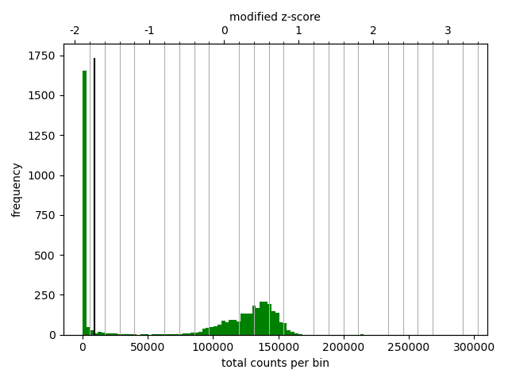

On observe pas de Gaussienne

### Diagnostic plot protocoles : OFFSPRING_1000000 

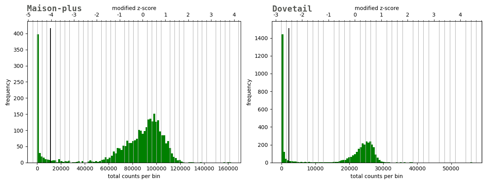

On observe pas de Gaussienne et un décalage de l'histogramme vers la gauche.

### Diagnostic plot : OFFSPRING_500000

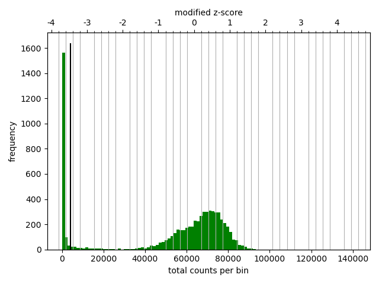

On observe pas de Gaussienne

### Diagnostic plot protocoles : OFFSPRING_500000

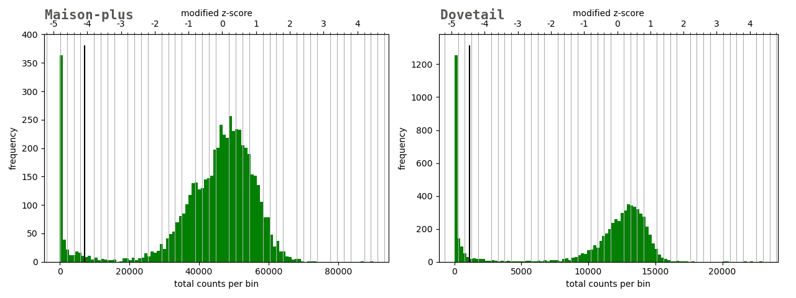

On observe pas de Gaussienne 'propre', mais on observe un décalage vers la gauche.

### Diagnostic plot : OFFSPRING_200000

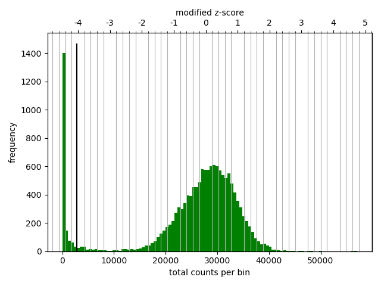

On commence a observer la Gaussienne

### Diagnostic plot protocoles : OFFSPRING_200000

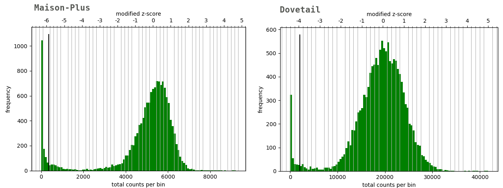

On observe une Gaussienne décalé vers la gauche avec un pic de fréquence à 0 'total count per bins' moins élevés.

### Diagnostic plot : OFFSPRING_50000

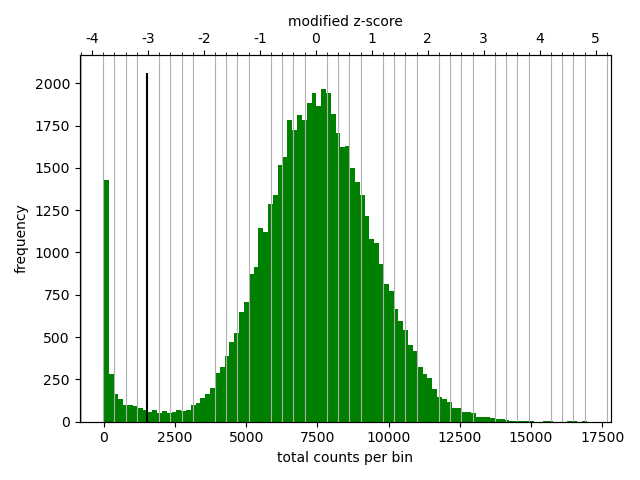

On observe une belle Gaussienne

### Diagnostic plot protocoles : OFFSPRING_50000

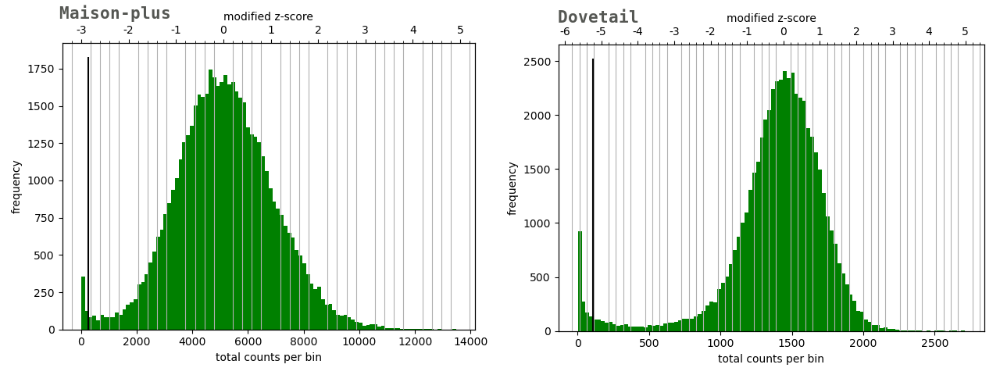

On observe une belle Gaussienne décalé vers la gauche avec un pic de fréquence à 0 'total count per bins' moins élevés.

### Différence Protocoles / Somme des protocoles 

On observe qu'en sommant les protocoles d'un individus, on retrouve des gaussienne mieux définie avec un décalage vers la droite. La différence entre un protocole riche en information (Maison-plus) et moins riches (Dovetail) est un décalage de cette gaussienne vers la gauche.

Ce décalage semble cohérent, moins on a d'informations, moins le 'total counts per bin' sera élevée. En sommant les matrices, on augmente la quantité d'informations disponible ce qui entraîne un décalage vers la droite.

## Étape 4 : Normalisation KR

Au vu des diagnostic plot, il est préférable de se concentrer uniquement sur les résolutions 200k et 50k bins.

Les diagnostics plots permettent d'établir un filterThreshold de -1.5 à 5.

```bash
# Listes des matrices d'interêt
matrices="OFFSPRING_200000.matrix.h5 OFFSPRING_50000.matrix.h5"

for mat in $matrices
do
  for m in hic_050820/*.h5
  do
    if [[ $m =~ $mat ]] ; then
      hicCorrectMatrix correct -m $m -o ${m%.matrix.h5}.corrected_matrix.h5 -t -1.5 5
    fi
  done
done
```

### Étude de diagnostic plot : avant / après normalisation

#### 200k bins resolutions :

```bash
hicCorrectMatrix diagnostic_plot -m hic_050820/OFFSPRING_200000.corrected_matrix.h5 -o hic_050820/OFFSPRING_200000.corrected.png
```

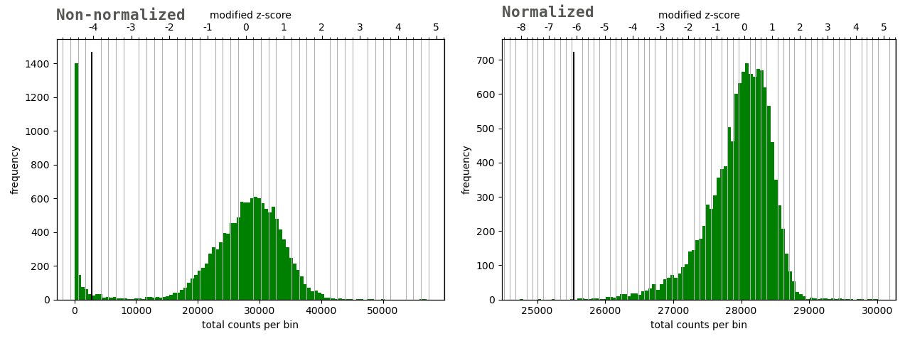

#### 50k bins resolutions :

```bash
hicCorrectMatrix diagnostic_plot -m hic_050820/OFFSPRING_50000.corrected_matrix.h5 -o hic_050820/OFFSPRING_50000.corrected.png
```

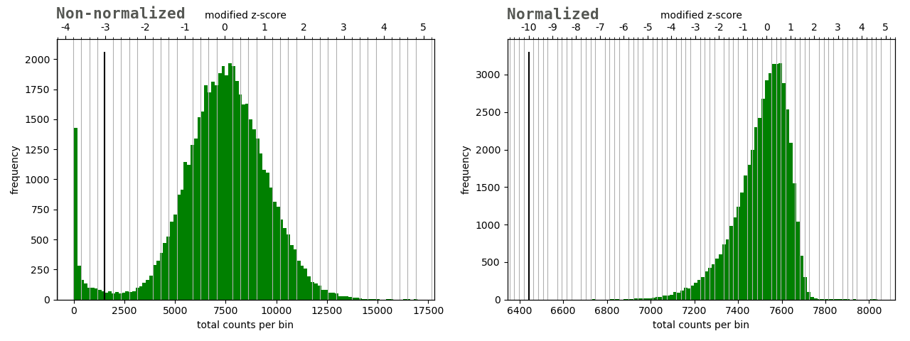


// TODO : Conclure sur l'impact de la normalisation

## Étape 5 : Carte chromosomique de la region

Dans le mail de Alain, l'ensemble des mutations portés sur le chromosome 1 ce situe entre les positions 2200000 et 2800000.

Pour étudier la présence ou non de rapprochement, il sera plotter les regions suivantes :

* chromosome 1 en entier
* chromosome 1 : 1M-6M
* chromosome 1 : 1M5-3M5

Ces cartes seront plotter uniquement sur la résolutions 50k bins, avant et après normalisations.

### Chromosome 1 : full length

```bash
# Non-normalized
hicPlotMatrix -m hic_050820/OFFSPRING_50000.matrix.h5 -o hic_050820/50k_full_length.png --chromosomeOrder 1 --log

# Normalized
hicPlotMatrix -m hic_050820/OFFSPRING_50000.corrected_matrix.h5 -o hic_050820/50k_full_length.corrected.png --chromosomeOrder 1 --log
```

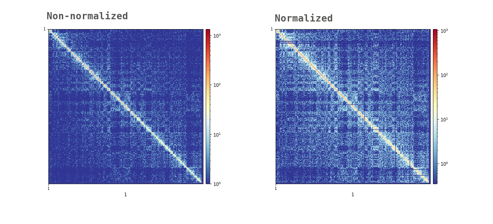

### Chromosome 1 : 1M - 6M

```bash
# Non-normalized
hicPlotMatrix -m hic_050820/OFFSPRING_50000.matrix.h5 -o hic_050820/50k_1M_6M.png --region 1:1000000-6000000 --log

# Normalized
hicPlotMatrix -m hic_050820/OFFSPRING_50000.corrected_matrix.h5 -o hic_050820/50k_1M_6M.corrected.png --region 1:1000000-6000000 --log
```

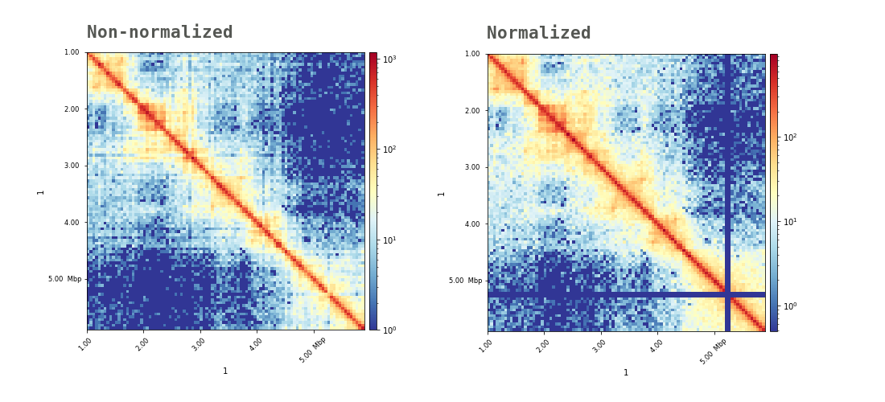

### Chromosome 1 : 1.5M - 3.5M

```bash
# Non-normalized
hicPlotMatrix -m hic_050820/OFFSPRING_50000.matrix.h5 -o hic_050820/50k_1M5_3M5.png --region 1:1500000-3500000 --log

# Normalized
hicPlotMatrix -m hic_050820/OFFSPRING_50000.corrected_matrix.h5 -o hic_050820/50k_1M5_3M5.corrected.png --region 1:1500000-3500000 --log
```

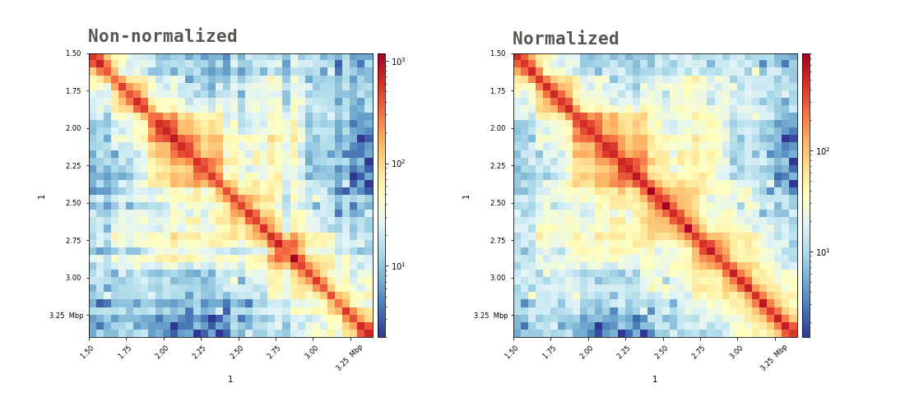

### Chromosome 1 : 2M - 3M

```bash
# Non-normalized
hicPlotMatrix -m hic_050820/OFFSPRING_50000.matrix.h5 -o hic_050820/50k_2M_3M.png --region 1:2000000-3000000 --log

# Normalized
hicPlotMatrix -m hic_050820/OFFSPRING_50000.corrected_matrix.h5 -o hic_050820/50k_2M_3M.corrected.png --region 1:2000000-3000000 --log
```

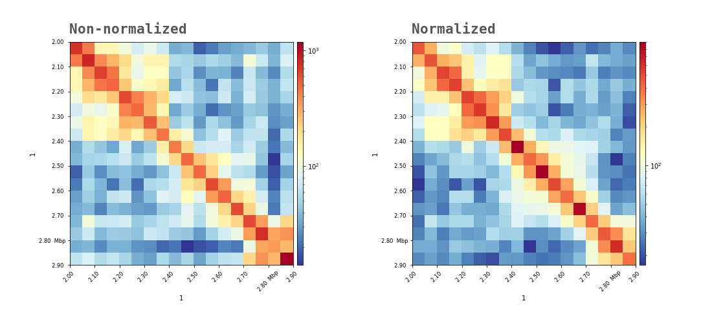

## Étape 6 : hicFindTADs

Au vu des précedents résultats, la recherche de TADs ne se fera qu'à la résolution 50.000 bins et ne concernera que le chromosome 1.

```bash
for matrices in OFFSPRING_*50000.*.h5
do
  prefix=${matrices#*_}
  prefix=TADs_${prefix%.h5}
  hicFindTADs -m $matrices \
  --outPrefix $prefix \
  --correctForMultipleTesting fdr \
  --correctForMultipleTesting fdr \
  --chromosomes 1
done
```

### Comparaison avant/après normalisation :

```bash
head TADs_50000.*_domains.bed
==> TADs_50000.corrected_matrix_domains.bed <==
1	1100000	1700000	ID_0.01_1	-0.355780500000	.	1100000	1700000	31,120,180
1	1700000	2400000	ID_0.01_2	-0.716555000000	.	1700000	2400000	51,160,44
1	2400000	2700000	ID_0.01_3	0.670196000000	.	2400000	2700000	31,120,180
1	2700000	3100000	ID_0.01_4	-0.016125000000	.	2700000	3100000	51,160,44
1	3100000	3900000	ID_0.01_5	-0.366331500000	.	3100000	3900000	31,120,180
1	3900000	4500000	ID_0.01_6	-0.620370000000	.	3900000	4500000	51,160,44
1	4500000	5700000	ID_0.01_7	-0.820334000000	.	4500000	5700000	31,120,180
1	5700000	6100000	ID_0.01_8	-0.039270500000	.	5700000	6100000	51,160,44
1	6100000	6700000	ID_0.01_9	-0.291370000000	.	6100000	6700000	31,120,180
1	6700000	7400000	ID_0.01_10	-0.915782000000	.	6700000	7400000	51,160,44

==> TADs_50000.matrix_domains.bed <==
1	750000	1700000	ID_0.01_1	-1.277625500000	.	750000	1700000	31,120,180
1	1700000	2400000	ID_0.01_2	-0.589637500000	.	1700000	2400000	51,160,44
1	2400000	3100000	ID_0.01_3	0.445744500000	.	2400000	3100000	31,120,180
1	3100000	3900000	ID_0.01_4	-0.271200000000	.	3100000	3900000	51,160,44
1	3900000	4500000	ID_0.01_5	-0.593133500000	.	3900000	4500000	31,120,180
1	4500000	6700000	ID_0.01_6	-0.842685500000	.	4500000	6700000	51,160,44
1	6700000	7350000	ID_0.01_7	-0.770401000000	.	6700000	7350000	31,120,180
1	7350000	9500000	ID_0.01_8	-0.970259500000	.	7350000	9500000	51,160,44
1	9500000	10150000	ID_0.01_9	-0.518217000000	.	9500000	10150000	31,120,180
1	10150000	10600000	ID_0.01_10	-0.164985000000	.	10150000	10600000	51,160,44

```

On observe que les versions normalisée et non-normalisée ne retourne pas les mêmes valeurs. La normalisation va donc jouer un rôle important dans l'établissement des TADs.

### Comparaison différents protocoles :

```bash
# Listes des matrices d'interêt
matrices="OFFSPRING_Dovetail_50000.matrix.h5 OFFSPRING_Maison-plus_50000.matrix.h5"

for mat in $matrices
do
  out=${mat%.matrix.h5}.corrected_matrix.h5
  
  hicCorrectMatrix correct -m $mat -o $out -t -1.5 5

  prefix=${out#*_}
  prefix=TADs_${prefix%.h5}
  
  hicFindTADs -m $mat \
  --outPrefix $prefix \
  --correctForMultipleTesting fdr \
  --correctForMultipleTesting fdr \
  --chromosomes 1
done
```

Enfin lecture des beds :

```bash
head *.corrected_matrix_domains.bed
==> TADs_50000.corrected_matrix_domains.bed <==
1	1100000	1700000	ID_0.01_1	-0.355780500000	.	1100000	1700000	31,120,180
1	1700000	2400000	ID_0.01_2	-0.716555000000	.	1700000	2400000	51,160,44
1	2400000	2700000	ID_0.01_3	0.670196000000	.	2400000	2700000	31,120,180
1	2700000	3100000	ID_0.01_4	-0.016125000000	.	2700000	3100000	51,160,44
1	3100000	3900000	ID_0.01_5	-0.366331500000	.	3100000	3900000	31,120,180
1	3900000	4500000	ID_0.01_6	-0.620370000000	.	3900000	4500000	51,160,44
1	4500000	5700000	ID_0.01_7	-0.820334000000	.	4500000	5700000	31,120,180
1	5700000	6100000	ID_0.01_8	-0.039270500000	.	5700000	6100000	51,160,44
1	6100000	6700000	ID_0.01_9	-0.291370000000	.	6100000	6700000	31,120,180
1	6700000	7400000	ID_0.01_10	-0.915782000000	.	6700000	7400000	51,160,44

==> TADs_Dovetail_50000.corrected_matrix_domains.bed <==
1	750000	1650000	ID_0.01_1	-1.170371377480	.	750000	1650000	31,120,180
1	1650000	2400000	ID_0.01_2	-0.751888635882	.	1650000	2400000	51,160,44
1	2400000	2700000	ID_0.01_3	0.264931355911	.	2400000	2700000	31,120,180
1	2700000	3200000	ID_0.01_4	-0.211882592016	.	2700000	3200000	51,160,44
1	3200000	3900000	ID_0.01_5	-0.573360421500	.	3200000	3900000	31,120,180
1	3900000	4500000	ID_0.01_6	-0.553367721618	.	3900000	4500000	51,160,44
1	4500000	6150000	ID_0.01_7	-0.794164679888	.	4500000	6150000	31,120,180
1	6150000	6650000	ID_0.01_8	-0.524528520231	.	6150000	6650000	51,160,44
1	6650000	7400000	ID_0.01_9	-0.701571955550	.	6650000	7400000	31,120,180
1	7400000	9600000	ID_0.01_10	-0.953369253143	.	7400000	9600000	51,160,44

==> TADs_Maison-plus_50000.corrected_matrix_domains.bed <==
1	750000	1700000	ID_0.01_1	-1.129774394823	.	750000	1700000	31,120,180
1	1700000	3900000	ID_0.01_2	-0.516673284690	.	1700000	3900000	51,160,44
1	3900000	4500000	ID_0.01_3	-0.555043668934	.	3900000	4500000	31,120,180
1	4500000	6700000	ID_0.01_4	-0.739083279149	.	4500000	6700000	51,160,44
1	6700000	7350000	ID_0.01_5	-0.692340981025	.	6700000	7350000	31,120,180
1	7350000	9150000	ID_0.01_6	-0.838160114076	.	7350000	9150000	51,160,44
1	9150000	10150000	ID_0.01_7	-0.396808431978	.	9150000	10150000	31,120,180
1	10150000	10600000	ID_0.01_8	-0.078642821592	.	10150000	10600000	51,160,44
1	10600000	11550000	ID_0.01_9	-0.153262830632	.	10600000	11550000	31,120,180
1	11550000	12850000	ID_0.01_10	-0.282503463892	.	11550000	12850000	51,160,44
```

On observe alors que certaines regions se recoupent plus ou moins, que ce soit entre Dovetail et Maison-plus, ou entre les protocoles individuels et la matrice sommée.

## Étape 7 : tracks.ini et hicPlotTADs

```bash
for matrices in *_50000.*_matrix.h5
do
  if [[ $matrices =~ 'zscore' ]]; then
    continue
  fi
  prefix=${matrices#*_}
  prefix=TADs_${prefix%.*}
  echo '[x-axis]
fontsize=10

[hic]
file = '$matrices'
title = '$prefix'
colormap = Spectral_r
transform = log
file_type = hic_matrix
show_masked_bins = false

[tads]
file = '$prefix'_domains.bed
file_type = domains
border_color = black
color = none
overlay_previous = share-y' > tracks_$prefix.ini
done
```

Puis pour chaque `tracks.ini`, faire un hicPlotTADs :

```bash
for tracks in tracks_*.ini
do
  hicPlotTADs --tracks $tracks -o ${tracks%.ini}_1m-6m.png --region 1:1000000-6000000
done
```

### hicPlotTADs : OFFSPRING_50000.corrected_matrix.h5

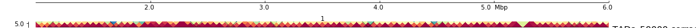

### hicPlotTADs : OFFSPRING_Dovetail_50000.corrected_matrix.h5

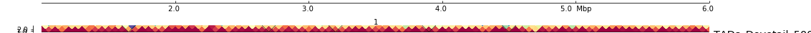

### hicPlotTADs : OFFSPRING_Maison-plus_50000.corrected_matrix.h5


