# Internship logbook

## Table of Contents
* [2020-07-01](#2020-07-01)
	* [Modification of wdir/datadir](#modify-wdirdatadir-)
	* [Copy results on local directory](#copy-results-on-local-directory-)
	* [Create conda env to HiCExplorer](#create-conda-env-to-hicexplorer-)
	* [Convert HiCPro to h5 format](#convert-hicpro-to-h5-matrix-)
	* [Construction of contact maps](#construction-of-contact-maps-)
* [2020-07-02](#2020-07-02)
	* [Move Conda Directory](#move-conda-directory-)
	* [Link to the main data](#link-to-the-main-data-)
	* [Meeting at 11:00 AM](#meeting-at-1100-am-)
	* [Download genome file](#download-genome-file-)
	* [All-In-One script](#all-in-one-script-)
* [2020-07-03](#2020-07-03)
	* [Analyze of output files](#analyze-of-output-files-)
		* [Contact map](#contact-map-)
		* [MultiQC report](#multiqc-report-)
	* [Preparation: Presentation Work](#preparation-presentation-work)
* [2020-07-06](#2020-07-06)
	* [Meeting at INRAE](#meeting-at-inrae-)
	* [Try real dataset](#try-real-dataset-)
		* [Script preparation](#script-preparation-)
* [2020-07-07](#2020-07-07)
	* [Run on a real dataset](#run-on-a-real-dataset-)
* [2020-07-08](#2020-07-08)
	* [New try on Offspring-Arima dataset](#new-try-on-offspring-arima-dataset-)
* [2020-07-09](#2020-07-09)
  * [All-In-One Script to run pipeline](#all-in-one-script-to-run-pipeline-)
* [2020-07-10](#2020-07-10)
* [2020-07-13](#2020-07-13)
* [2020-07-15](#2020-07-15)
  * [Moving work directory](#moving-work-directory-)
  * [Influence of the provided restriction and ligation motifs](#influence-of-the-provided-restriction-and-ligation-motifs-)
* [2020-07-16](#2020-07-16)
  * [Restriction and ligation motifs](#restriction-and-ligation-motifs-)
  * [First steps with COOLER](#first-steps-with-cooler-)
* [2020-07-17](#2020-07-17)
  * [init_hicexplorer.sh](#init_hicexplorer.sh-)
  * [hicCorrectMatrix and hicSumMatrices](#hiccorrectmatrix-and-hicsummatrices-)
* [2020-07-20](#2020-07-20)
  * [Create map : Proccess stoped - Out of Memory](#create-map--proccess-stoped---out-of-memory)
  * [EDIT : init_hicexplorer.sh](#edit--init_hicexplorersh-)
* [2020-07-21](#2020-07-21)
  * [Visio-Reunion](#visio-reunion-)
  * [Comparison between KR normalization and ICE normalization](#comparison-between-kr-normalization-and-ice-normalization-)

# 2020-07-01

## Modify wdir/datadir :

`wdir=/home/jmartin/work/polledHiC/work/test`

`datadir=/home/jmartin/work/polledHiC/data`

Then run README.sh

## Copy results on local directory :

```bash
pref=/home/jmartin/work/polledHiC/work/test/nfcorehic
cpdir="hic_results mapping MultiQC pipeline_info"
for dir in $cpdir
do
	scp -r jmartin@genologin.toulouse.inra.fr:$pref/$dir .
done
```

## Create conda env to HiCExplorer :

```bash
# Load module
module load system/Miniconda3-4.7.10

# Create conda env
conda create --name hicexplorer python=3.6

# Activate env 
conda activate hicexplorer

# Set channels
conda config --add channels defaults
conda config --add channels bioconda
conda config --add channels conda-forge

# Install other dependencies
conda install hic2cool=0.7 cooler=0.8.5 eigen openmp krbalancing=0.0.5 fit_nbinom=1.1 pybedtools=0.8

# Then Install hicexplorer
conda install hicexplorer=3.4.3
```

!! **Not able to create conda env :** *Errno 28 NoSpaceLeftError: No space left on devices* !!

**EDIT :** *After several try, it finished to create it correctly.*

## Convert HiCPro to h5 matrix :

Copy to convertHiC.sh :
```bash
#!/bin/bash

# Set environment variable
wdir=/home/jmartin/work/polledHiC/work/test
rawdir=/home/jmartin/work/polledHiC/work/test/nfcorehic/hic_results/matrix/raw
h5dir=/home/jmartin/work/polledHiC/work/test/nfcorehic/hic_results/matrix/h5_matrix
runid=convertHicpro2h5

# Create outdir
mkdir -p $h5dir

# Convertion
for mat in $rawdir/*.matrix
do
	outname=${mat#*CDFVM_}
	hicConvertFormat --matrices $mat --outFileName $h5dir/$outname --bedFileHicpro ${mat%.matrix}_abs.bed --inputFormat hicpro --outputFormat h5
done
```

**!! WARNING : You have to run this script in a dedicated session _(srun -c 8 --pty bash)_ !!**

## Construction of contact maps :

Copy in createMap.sh :

```bash
#!/bin/bash
#SBATCH -J plotmap
#SBATCH -e plotmap.err
#SBATCH -o plotmap.log
#SBATCH -p workq
#SBATCH --mail-type=END,FAIL
#SBATCH --export=ALL
#SBATCH --cpus-per-task=1
#SBATCH --mem=250G

module purge
module load system/Miniconda3-4.7.10
module load bioinfo/HiCExplorer-v3.4.3

matdir=/home/jmartin/work/polledHiC/work/test/nfcorehic/hic_results/matrix/h5_matrix

cd $matdir

for matrix in *.h5
do
	hicPlotMatrix --matrix $matrix --outFileName ${matrix%.matrix.h5}_map --title ${matrix%.matrix*}
	hicPlotMatrix --matrix $matrix --outFileName ${matrix%.matrix.h5}_log1p_map --log1p --title ${matrix%.matrix*}_log1p
	hicPlotMatrix --matrix $matrix --outFileName ${matrix%.matrix.h5}_log_map --log --title ${matrix%.matrix*}_log
done
```

# 2020-07-02

## Move Conda Directory :

I removed all the content of `~/.conda/` directory and I created a directory in the `save directory`.

When it's done, I created a symoblinc link from `~/save/.conda/` to `~/.conda/`. Normally, this should be prevent the *Errno25 NoSpaceLeftError*.

I put in place a new conda environment doing (this procedure)[#copy-results-on-local-directory-].

As expected, I didn't have the issue *Errno28*.

## Link to the main data :

I had to create a link with the main data, respecting this hierarchy.

```
├── polledHiC
│   ├── data
|   |    ├── reads
|   |    |    ├── trio1.mother.protocolA
|   |    |    ├── trio1.mother.protocolB
|   |    |    ├── trio1.offspring.protocolA
|   |    |    └── ...
|   |    └── genome
```
Each subdir should contains symbolic links to HiC fastq files of the sequoccin hic repository datadir.

First, I extracted a list of all the reads available on that directory :
```bash
ls /work2/project/seqoccin/data/reads/hic/bos_taurus > list_file.txt
```

After that, I extract the name for all needed directory :
```bash
for file in $(cat list_file.txt) ; do echo ${file%%_*} ; done | \
sed 's/.run*.//g' | sort | uniq > directory_to_create.txt
```

At this moment, if I look in this file, I have one line for each datadir I want to create :
```
trio1.father.Arima
trio1.father.Dovetail
trio1.father.Maison
trio1.father.PhaseG
trio1.mother.Arima
trio1.mother.Dovetail
trio1.mother.Maison
trio1.offspring.Arima
trio1.offspring.Dovetail
trio1.offspring.Maison-minus
trio1.offspring.Maison-plus
trio1.offspring.Phase
trio2.father.Maison
trio2.mother.Maison
trio2.offspring.Maison
```

I had to create these directory :
```bash
for dir in $(cat directory_to_create.txt)
do
  mkdir ~/work/polledHiC/data/reads/$dir
done
```

Next step was to create symbolic link between data and new directory. To realize this, I design a small script that I put on `~/work/polledHiC/data/` :

```bash
#!/bin/bash

readsdir=/work2/project/seqoccin/data/reads/hic/bos_taurus
datadir=/home/jmartin/work/polledHiC/data/reads

for file in $(cat list_file.txt)
do
  subdir=$(echo ${file%%_*} | sed 's/.run*.//g')
  ln -s $readsdir/$file $datadir/$subdir/$file
done
```

## Meeting at 11:00 AM :

Fix objectives to Monday :

* Finish to prepare data directory.
* Analyze the first output from test data.
* Prepare a presentation of different output.
* Prepare a presentation of different informations from MultiQC rapport.

## Download genome file :

Genome fasta file is downloaded thank's to `wget` :

```bash
# Set working directory
cd ~/work/polledHiC/data/genome

# Download with wget
wget ftp://ftp.ensembl.org/pub/release-100/fasta/bos_taurus/dna/Bos_taurus.ARS-UCD1.2.dna_sm.toplevel.fa.gz

# Decompress (gzip archive aren't compatible with Samtools faidx)
gzip -d Bos_taurus.ARS-UCD1.2.dna_sm.toplevel.fa.gz
```

When all it's done, I had to index the genome file :
```bash
module load bioinfo/samtools-1.10
samtools faidx Bos_taurus.ARS-UCD1.2.dna_sm.toplevel.fa

module load bioinfo/bowtie2-2.3.5.1
bowtie2-build Bos_taurus.ARS-UCD1.2.dna_sm.toplevel.fa Bos_taurus.ARS-UCD1.2.dna_sm.toplevel.bt
```

Everything is ready now to start the analyzes on Monday.

## All-In-One script :

Because it's more user-friendly, I purpose here a All-In-One script to automate all the previous step. I reached to group two step in one here : I control the creation of subdirectory at same time I create symbolic link. I named it as `exportData.sh` and it's on `~/work/polledHiC/data/.`

```bash
#!/bin/bash

# Environment preparation
echo "Environment Preparation"
echo -n "-" ; sleep 0.2 ; echo -n "-" ; sleep 0.2 ; echo "-"
readsdir=/work2/project/seqoccin/data/reads/hic/bos_taurus
datadir=/home/jmartin/work/polledHiC/data/reads
genome=/home/jmartin/work/
echo "Environment OK"

# List of read files
echo "Acquisition of reads files"
echo -n "-" ; sleep 0.2 ; echo -n "-" ; sleep 0.2 ; echo "-"
list_file=$(ls $readsdir)

# Creation of subdirectories and symbolic links
echo "Creation of subdirectories and symbolic links"
echo -n "-" ; sleep 0.2 ; echo -n "-" ; sleep 0.2 ; echo "-"
for file in $list_file
do
  subdir=$(echo ${file%%_*} | sed 's/.run*.//g')
  if [ -d $datadir/$subdir ]; then
  	ln -s $readsdir/$file $datadir/$subdir/$file
  else
  	mkdir -p $datadir/$subdir
  	echo "Creation of $subdir"
  	ln -s $readsdir/$file $datadir/$subdir/$file
  fi
done

echo "Export reads data finished !"
sleep 2

# Export Genome data
echo "Start exporting Genome data"
echo -n "-" ; sleep 0.2 ; echo -n "-" ; sleep 0.2 ; echo "-"

cd genome/

wget ftp://ftp.ensembl.org/pub/release-100/fasta/bos_taurus/dna/Bos_taurus.ARS-UCD1.2.dna_sm.toplevel.fa.gz
echo "Start decompress archive"
echo -n "-" ; sleep 0.2 ; echo -n "-" ; sleep 0.2 ; echo "-"
gzip -d Bos_taurus.ARS-UCD1.2.dna_sm.toplevel.fa.gz
echo "Decompress SUCCESS"

echo "Writting sbatch script"
echo -n "-" ; sleep 0.2 ; echo -n "-" ; sleep 0.2 ; echo "-"
echo "#!/bin/bash
#SBATCH -J "index_genome"
#SBATCH -o %j.out
#SBATCH -e %j.err
#SBATCH -p workq
#SBATCH --cpus-per-task=1
#SBATCH --mem=8G
#SBATCH --export=ALL

module purge
module load bioinfo/samtools-1.10
module load bioinfo/bowtie2-2.3.5.1

samtools faidx Bos_taurus.ARS-UCD1.2.dna_sm.toplevel.fa

bowtie2-build Bos_taurus.ARS-UCD1.2.dna_sm.toplevel.fa Bos_taurus.ARS-UCD1.2.dna_sm.toplevel.bt " > indexing_script.sh
echo "SBATCH Script written \n"

# Then
echo "Submit sbatch query"
echo -n "-" ; sleep 0.2 ; echo -n "-" ; sleep 0.2 ; echo "-"
sbatch indexing_script.sh
```

# 2020-07-03

## Analyze of output files :

On test dataset, pipeline return us lot of different results. I purpose to focus us on some of them :

* Contact map (`[...]/nfcorehic/hic_results/matrix`) : contains several matrix of contact mapping at different resolutions.
* MultiQC report give us many statistical informations, including :
	* alignment statistics (`[...]/nfcorehic/mapping/stats/trio1.offspring.run1.Maison-plus_GACGTC-CDFVM_L001_bwt2pairs.pairstat`)
	* pairing statistics (`[...]/nfcorehic/hic_results/stats/.../trio1.offspring.run1.Maison-plus_GACGTC-CDFVM_L001.mRSstat`)

### Contact map :

A contact map is defined by :

* A list of genomic intervals related to the specified resolution (--in-size argument of nfcore pipeline) = BED FORMAT.
* A matrix, stored as standard triplet sparse format = .tsv FORMAT.

For instance, here is a presentation at the lowest resolutions :

**Bed file :**

| Chrom_ID       	| Start   	| End     	| Name 	|
|----------------	|---------	|---------	|------	|
| 1              	| 0       	| 1000000 	| 1    	|
| 1              	| 1000000 	| 2000000 	| 2    	|
| 1              	| 2000000 	| 3000000 	| 3    	|
| ...            	| ...     	| ...     	| ...  	|
| NKLS02002208.1 	| 8000000 	| 9000000 	| 4833 	|
| NKLS02002208.1 	| 9000000 	| 9309904 	| 4834 	|
| NKLS02002209.1 	| 0       	| 27572   	| 4835 	|

**Matrix :**

| Read1 	| Read2 	| Counts? 	|
|-------	|-------	|--------	|
| 1     	| 1     	| 40     	|
| 1     	| 2     	| 12     	|
| 1     	| 4     	| 4      	|
| ...   	| ...   	| ...    	|
| 4836  	| 4836  	| 80     	|
| 4837  	| 4837  	| 3      	|

To be used to create image map, this matrix need to be transformed in HDF5 format. This format is a complex compressed format structured as :
```
── matrix [HDF5 group]
    ├── barcodes
    ├── data
    ├── indices
    ├── indptr
    ├── shape
    └── features [HDF5 group]
        ├─ _all_tag_keys
        ├─ feature_type
        ├─ genome
        ├─ id
        ├─ name
        ├─ pattern [Feature Barcoding only]
        ├─ read [Feature Barcoding only]
        └─ sequence [Feature Barcoding only]
```

### MultiQC report :

MultiQC report provides us lots of statistical informations. A great advantage from MultiQC is that return all of these as clearly graph.

**Read Mapping :**

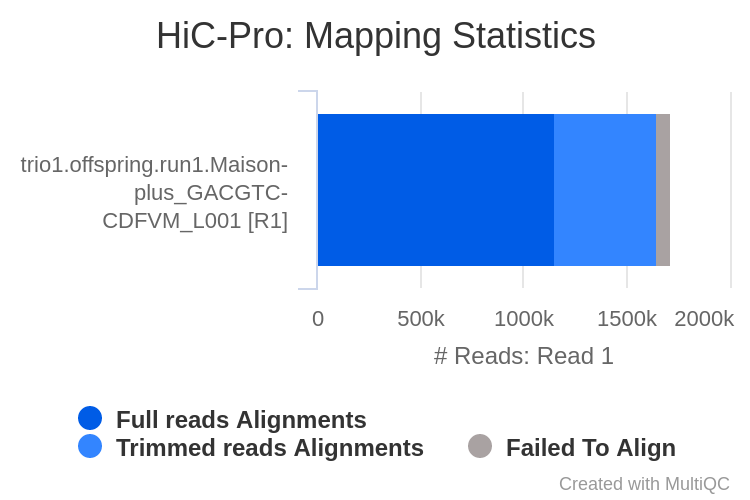

> Full reads Alignments: 67.2%
>
> Trimmed reads Alignments: 28.9%
>
> Failed to Align: 3.9%

This part describes the alignment of reads in single-end mode. It can be seen that there are a very small amount of unaligned read, it seems that the mapping is a success.

**Read Pairing :**

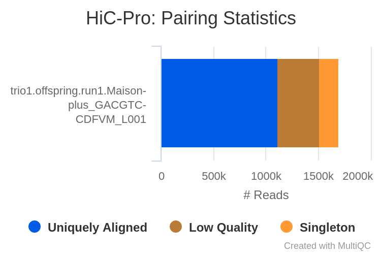

> Uniquely Aligned: 65.8%
>
> Low Quality: 23.3%
>
> Singleton: 10.9%

This part describes how the reads are paired of single-end mapping. It looks like about 10% of the reads aren't paired.

**Read Pair Filtering :**

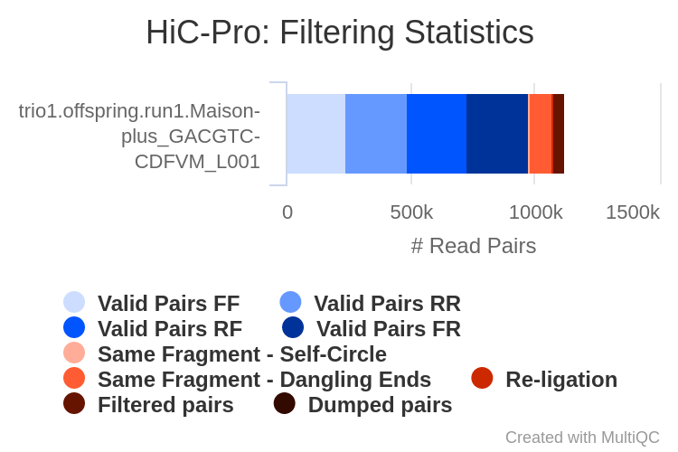

> Valid Pairs FF: 21.8%
>
> Valid Pairs RR: 21.8%
>
> Valid Pairs RF: 21.5%
>
> Valid Pairs FR: 22.3%
> 
> Same Fragment - Same Circle: 0.3%
> 
> Same Fragment - Danglging Ends: 8.1%
> 
> Re-ligation: 0.8%
> 
> Filtered pairs: 3.5%
> 
> Dumped pairs: 0.0%

This part describes how the reads pairs are 'organized'. It seems that the reads pairs without any preference either there are forward or reverse reads.

It's possible to see that there are about 11% of filtered pairs *( = duplicate ? )* and same fragment pairs *( = singleton ? )*.

**Contact Statistics :**

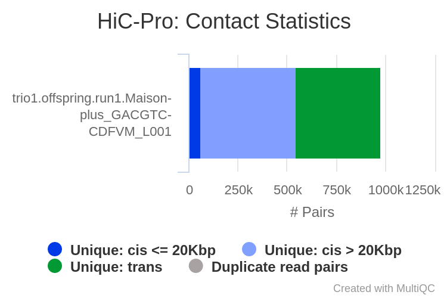

> Unique: cis <=20Kbp: 5.9%
> 
> Unique: cis > 20Kbp: 49.8%
> 
> Unique: trans: 44.2%
> 
> Duplicate read pairs: 0.0%

This part describes how contacts are 'organized' after duplicates removal. With this test dataset, the interractions are long-range cis- interractions (same chromosome but with more than 20Kbp of distance) or trans- interractions (regions are on differents chromosomes).

## Preparation: Presentation Work

As the firsts analyzes are done, and the environment ready to work with true data set, I focus my afternoon to prepare a presentation support of these analyze for Monday.

# 2020-07-06

## Meeting at INRAE :

* [x] Presentation
* [x] Study of the pipeline
* [x] Discussion about next step
* [x] Discussion about the differents methods of normalization
* [x] Talk about two publication to add to biblio
* [x] Discussion about the problem while I analyzed the real dataset

## Try real dataset :

### Script preparation :

Head preparation :

```bash
# Testing the pipeline on a real data set
# trio1.offspring.run1.Maison-plus fastq files
wdir=/home/jmartin/work/polledHiC/work/offspring    # The working dir
runid=nfcorehic.Arrima    # simply a name describing the sample
datadir=/home/jmartin/work/polledHiC/data
reads=$datadir/reads/trio1.offspring.Arima    # directory with reads
genome=$datadir/genome/Bos_taurus.ARS-UCD1.2.dna_sm.toplevel    # path of the genome file with associateds bowtie indexe (see bottom of the page for an example)
chromsize=/home/jmartin/work/polledHiC/data/genome/chrom.len    # a tab separated file with chromosome length : chr_id   length, one line per chromosome
outdir=$wdir/$runid
script=$outdir.sh
log=$outdir.log
err=$outdir.err

# Parametre of restriction/ligation
restriction='^GATC, G^ANTC'
ligation='GATCGATC, GANTGATC, GANTANTC, GATCANTC'
```

Then, I replaced the restriction/ligation variable by newest :

```
50 -  --restriction_site  '"'"'A^AGCTT'"'"' \ -> '"'"$restriction$"'"'
51 -  --ligation_site     '"'"'AAGCTAGCTT'"'"' \ -> '"'"$ligation"'"'
```

There are some errors in the pipeline but I can't understand why... The error output is empty, but there is a '.nextflow.log' where we can see this line `juil.-06 09:55:27.980 [main] INFO  nextflow.Nextflow - [nf-core/hic] Pipeline completed with errors
`.

To try to fix this, I will try with the same genome reference as for test dataset and not with the genome reference I download on my login.

So I replace :

```
genome=$datadir/genome/Bos_taurus.ARS-UCD1.2.dna_sm.toplevel
```

by reference available on cluster :

```
genome=/bank/bowtie2db/ensembl_bos_taurus_genome
```

It seems that works and that fixed my problem. I have to search an explanation for this comportment.

EDIT : At the end, the job crashed. Exit code = 1...

As the job continue to crash, I tried to re-run the test job : it crashed to. I try to move the `~/.nextflow` directory to `~/save/.nextflow` and to create a symoblic link to give more space to NextFlow (symbolic link tried with /home/jmartin/save/.nextflow and with /save/jmartin/.nextflow).

It seems this solution create new error referenced in `test/nfcorehic.log`: 'impossible de créer le répertoire « /home/jmartin/.nextflow/tmp »: Système de fichiers accessible en lecture seulement'. I try to fix it creating manualy these two directories, but didn't fix anything : nextflow can't write on this directory.

After a `ls -altr ~/save/`, I can see that the two directories `.conda` and `.nextflow` had sames rights, so I purpose that nextflow needs to create its own directories to have good rights. I removed the symbolic link, the directories `save/.nextflow` and I re-runed the test/README.sh .

Executed like this, the test didn't crash. I had to change the runid variable because .err file returned that the job crashed because there is already a job with same name.

I tried to re-run offspring/README.sh , but it continue to crash...

.log file begin by :
```bash
N E X T F L O W  ~  version 19.04.0
Launching `nf-core/hic` [jm-nfcorehic_offspring-Arrima] - revision: 481964d91c [1.1.0]
WARN: It appears you have never run this project before -- Option `-resume` is ignored
WARN: Access to undefined parameter `genomes` -- Initialise it to a default value eg. `params.genomes = some_value`
ERROR ~ /MiSeq

 -- Check '.nextflow.log' file for details
```

 When re-running, the error can change to `ERROR ~ /Nanopore`.

 Then when I check `.nextflow.log` there is 'juil.-06 10:59:31.193 [main] INFO  nextflow.Nextflow - [nf-core/hic] Pipeline completed with errors'

 EDIT : The error was du to a bad variable's name attribution.
	
# 2020-07-07

## Run on a real dataset :

When I ran the pipeline on Offspring.Arima, the pipeline return an error :

```bash
Command output:
  Unable to detect offset for 
  Please, use '^' to specified the cutting position, i.e A^GATCT for HindIII digestion
```

**! Note :** *When you precise restriction and ligation site, there shouldn't be space between two pattern i.e restriction='^GATC,G^ANTC' and not restriction='^GATC, G^ANTC'* **!**

On `trio1.offspring.Arima` dataset, the pipeline worked during 6h before an error occured. It looks like there is a problem with bowtie.

# 2020-07-08

## New try on Offspring-Arima Dataset :

After several try, we've found that the time limit was set by a config file in `~/.nextflow/assests/nf-core/hic/conf` but I can't fix this :

* If I try to modify values on this file, the pipeline dosen't exec.
* If I try to copy config file and to modify config path in the pipeline, there are some errors.

I think the problem is on the profile 'genotoul' configuration but I don't reach yet how to edit or create a new profile configuration.

# 2020-07-09

Today I had an email from Thomas who said that he found a solution for our problem. I applied it to my script and it looks like this fix the problem.

## All-In-One Script to run pipeline :

As everything was running, I was able to focus on another All-In-One script to process all of the datasets to study.

I would like this script was able to initiate directly the pipeline on each datasets.

At the end, this script should be able to :

* create a specific working directory for each datasets.
* create a specific script to run the pipeline for each datasets.
* submit the job on the cluster for each datasets.

# 2020-07-10

Today I re-write the AIO Script to extract a file that contains paths of all script. This final version of the AIO Script will be available in the Script folder of this repository git.

Also I run all the sbatch scripts to analyze the results next week.

# 2020-07-13

When I started to work today, I seen that only 2 runs of 15 are completed. About the aborted runs :

* two of them returned an error `Unknown error accessing project 'nf-core/hic' -- Repository may be corrupted: /home/jmartin/.nextflow/assets/nf-core/hic`.
* two of them didn't have good parameters for restriction and ligation fragment (I don't have these information for "Phase" datasets).
* eight of them were aborted because there were not more space on my work directory.
* one of them returned an issue in nextflow.log : 
	
	> `ERROR nextflow.processor.TaskProcessor - Error executing process > 'getRestrictionFragments (ensembl_bos_taurus_genome [A^AGCTT])'` 
	> `Caused by:  java.io.IOException: Gestionnaire de fichiers périmés`

I controlled the two runs that finished, and I didn't see any issue on logs or errs files.

After clean my work space, I re-analyzed the failed runs but I had some failed run quickly because `run name has been already use`... I think that it will there be a problem with the space available on my genologin space... The `polledHiC/work/` directory already contains more than 900Gb of data.

# 2020-07-15

## Moving work directory :

To fix the space issue, I moved my working directory on `/work2/genphyse/dynagen/tfaraut/polledHiC/jeremy/`. Here I copy my bt2_end2end.conf and init.sh files. After that I modified all of relatives paths in my init.sh, I can select the path of all protocols from Offspring species.

I ran all analyzes of Offspring less Phase protocol, because I don't have informations concerning restriction and ligation motifs.

## Influence of the provided restriction and ligation motifs :

For the 3rd week, I have to study the influence of the provided restriction and ligation motifs. So I duplicated the trio1.offspring.Arima folder, and I exchanged the motifs for the Arima protocol with the motifs for the Maison protocol.  This study was called trio1.offspring.Arima_to_Maison and ran alongside all the other runs.

# 2020-07-16

When I resume my studies, I saw that only three of six runs were complete. One of theme didn't have sufficient memory and the two others didn't have enough space.

As recommended by Thomas's mail, I delete the trio2.offspring results and working directory to free disk space and I rerun my analyze.

## Restriction and ligation motifs :

The analyze of Arima_to_Maison set was very quick. But unfortunately, this analyze didn't tell me much information. The run's status is **COMPLETED** but the pipeline didn't compute the MultiQC Report :

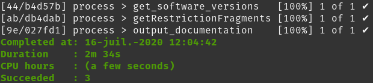

Also, there is not any 'results' folder where I could seen any statistics about the pipeline... I suppose that giving bad restriction and ligation motifs return 0 exploitable results to continue the pipeline.

As we can see, the Arima_to_Maison directory don't contains any file of interest to give to us a statistical impact of the provided motifs :

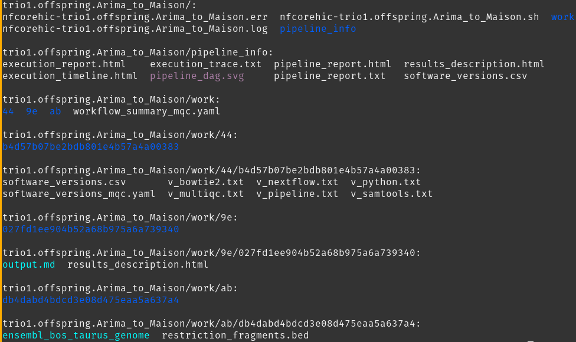

## First steps with COOLER :

During the execution of all analyze, I begin to discover COOLER, a tool that can allow us to sum matrices to have only one matrices and only one map for each species. So I start to search any information of how function cooler and how to sum HiC matrix.

I see that [HiC Explorer](https://hicexplorer.readthedocs.io/en/latest/content/tools/hicSumMatrices.html) can allow us to realize this sum, using cooler as dependencies. I think it's a good beginning step, but I also need to wait that my analyze finished to do a quick statistics report before sum them.

# 2020-07-17

## init_hicexplorer.sh :

I wrote a script to convert raw matrices into h5 file. In this script, I put a part to create the chromosomic map, but it required to much memory to run, so I keep it commented.

You can find this script **[HERE](https://github.com/StructVarGA/polledHiC/commit/b9d542b3f080c5726797aa0887efba9ddea04bb9#diff-8e7271371616aea590c85fd3629f375f)**.

This script will create subscript on each subdirectories and a text file that contains the path of all subscript. 

Like this, if I want to run all subscripts, it's possible with this loop :
```bash 
for path in $(cat HiCExplorer_paths.txt)
do
  sbatch $path 
done
```

But I still can run only one subscript if I want realize some test.

## hicCorrectMatrix and hicSumMatrices :

When all h5 matrix was available, I can start to do some try with hicCorrectMatrix and hicSumMatrices.

Thank's to *[this guide](https://hicexplorer.readthedocs.io/en/latest/content/example_usage.html#creation-of-a-hi-c-matrix)*, I realized following steps :

```bash
# Diagnostic plot :
hicCorrect
Matrix diagnostic_plot -m h5df/run1.Arima_CTTGTA-CDFVM_L001_1000000.matrix.h5 -o hic_corrected.png
```

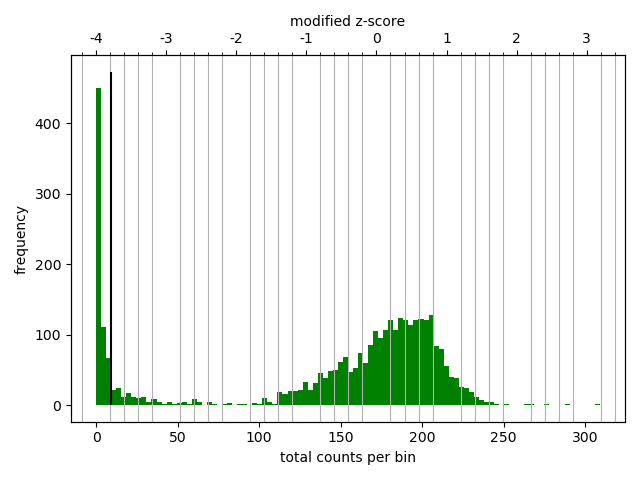

On this histogram, we can see, we didn't have a beautifull Gaussian like in the guide.

Well I had to choose the filter threshold, I think between -1 and 5 it's a good frame :

```bash
# Correction
hicCorrected correct -m h5df/run1.Arima_CTTGTA-CDFVM_L001_1000000.matrix.h5 --filterThreshold -1 5 -o hic_corrected.h5
```
I tried to see the diagnostic_plot after correction, and it's possible to see a better Gaussian than precedently

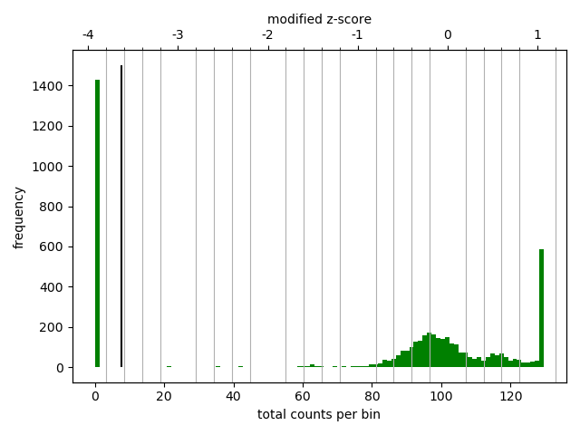

Thank's to hicInfo, I was able to compare both corrected with KR-methods (i.e. default choice) or un-corrected :
```
==> With_correction <==
# Matrix information file. Created with HiCExplorer's hicInfo version 3.4.3
File:	hic_corrected.h5
Size:	4,837
Bin_length:	1000000
Sum of matrix:	313477.9415155866
Non-zero elements:	342,779
Minimum (non zero):	6.45685757908442e-09
Maximum:	129.61668024010612
NaN bins:	0

==> Without_correction <==
# Matrix information file. Created with HiCExplorer's hicInfo version 3.4.3
File:	h5df/run1.Arima_CTTGTA-CDFVM_L001_1000000.matrix.h5
Size:	4,837
Bin_length:	1000000
Sum of matrix:	313474.0
Non-zero elements:	340,732
Minimum (non zero):	1.0
Maximum:	114.0
NaN bins:	0
```

So we can see that after correction, there are more non-zero elements and the sum of matrix is pretty higher than sin-correction.

Also I tried to sum matrices. I ran the following tests :

* [x] sum run1.Arima_CTTGTA-CDFVM_L001_1000000.matrix.h5 with run2.Arima_CTTGTA-AH5HWKBBXY_L001_1000000.matrix.h5 (I have done the correction of run2 before).
* [x] sum these two same matrices after correction.

```bash
# Creation subdirectories :
mkdir -p sum_experiement/with_corr
mkdir -p sum_experiment/without_corr

# Sum with corr
hicSumMatrices -m sum_experiment/with_corr/run1_corrected.h5 sum_experiment/with_corr/run2_corrected.h5 -o sum_experiment/with_corr/sumed_corrected.h5

# Sum without corr
hicSumMatrices -m h5df/run1.Arima_CTTGTA-CDFVM_L001_1000000.matrix.h5 h5df/run2.Arima_CTTGTA-AH5HWKBBXY_L001_1000000.matrix.h5 -o sum_experiment/without_corr/sumed_uncorrected.h5
```

After this, hicInfo return the following information :
```
==> with_corr/Summed_Infos <==
# Matrix information file. Created with HiCExplorer's hicInfo version 3.4.3
File:	sum_experiment/with_corr/sumed_corrected.h5
Size:	4,837
Bin_length:	1000000
Sum of matrix:	24476451.952337086
Non-zero elements:	5,819,385
Minimum (non zero):	1.5510828469503455e-05
Maximum:	10120.509385956626
NaN bins:	0

==> without_corr/Summed_Infos <==
# Matrix information file. Created with HiCExplorer's hicInfo version 3.4.3
File:	sum_experiment/without_corr/sumed_uncorrected.h5
Size:	4,837
Bin_length:	1000000
Sum of matrix:	24612099.5
Non-zero elements:	5,817,837
Minimum (non zero):	1.0
Maximum:	9975.0
NaN bins:	0
```
This is inconsistent with the hicInfo of each independent run. I need to realize a more accurate study...

# 2020-07-20

## Create map : Proccess stoped - Out of Memory

When I try to create chromosome map with all the genome, I catched 'Out of Memory' error. After several try, I understand that there are lot of unmappable contig on the set and if I focus me only on chromosome and not on chromosome + contigs, I was able to create map !

For instance, with the Arima set, if I run this command from `../trio1.offspring.Arima/hic_results/matrix/`:

```bash
# Run 1
hicPlotMatrix --matrix sum_experiment/with_corr/run1_corrected.h5 -o run1_corrected.png --chromosomeOrder 1 2 3 4 5 6 7 8 9 10 11 12 13 14 15 16 17 18 19 20 21 22 23 24 25 26 27 28 29 X --log1p
```

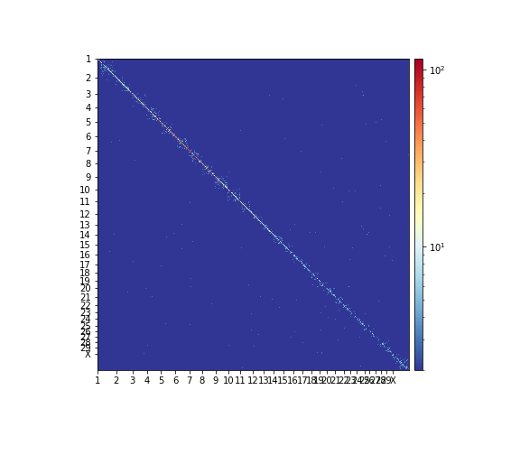

```bash
# Run 2
hicPlotMatrix --matrix sum_experiment/with_corr/run2_corrected.h5 -o run2_corrected.png --chromosomeOrder 1 2 3 4 5 6 7 8 9 10 11 12 13 14 15 16 17 18 19 20 21 22 23 24 25 26 27 28 29 X --log1p
```


```bash
# Sum of Runs 1 & 2
hicPlotMatrix --matrix sum_experiment/with_corr/sumed_corrected.h5 -o sumed_corrected.png --chromosomeOrder 1 2 3 4 5 6 7 8 9 10 11 12 13 14 15 16 17 18 19 20 21 22 23 24 25 26 27 28 29 X --log1p
```

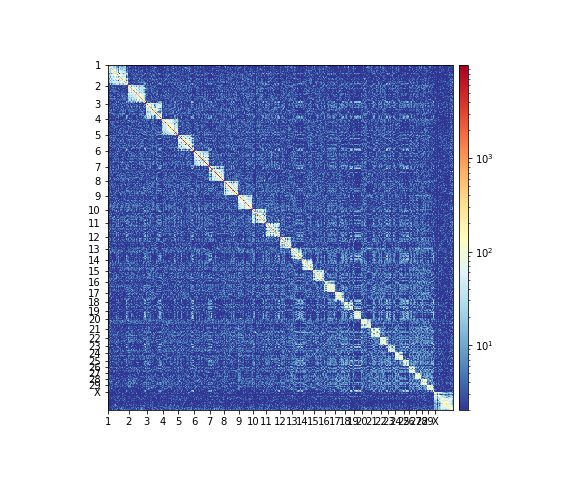

As we can saw, the map is pretty equals between sumed_corrected.png and run2_corrected.png

This can be explained because run2 contains very more informations than run1. I was able to see the same thing with corrected runs :

* **Run 2 - Corrected :**
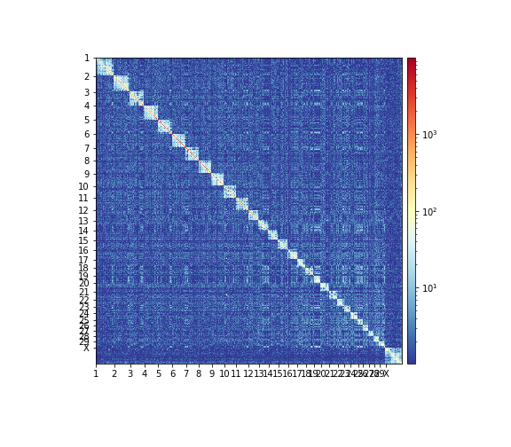

* **Sum - Un-corrected :**


So I think this results put in relief that a normalization could be necessary.

## EDIT : init_hicexplorer.sh :

I modify the [init_hicexplorer.sh](https://github.com/StructVarGA/polledHiC/blob/master/scripts/init_hicexplorer.sh) script to be able to create contact maps. But I realize that I didn't code how to sum the differents matrices.

I started to think about a solution to do that, but the main problematic is that I need to loop where resolutions are equals (I can't sum a 1000000 bins matrix with a 200000 bins matrix). So I need to find a solution to recognize what is run1 or run2 (or run3 whene there is one) AND what resolution is.

This part is an important TO-DO part to automate my analyze but I need to perform a better normalization before so I will put it aside for the moment.

# 2020-07-21

## Visio-reunion :

TO-DO :

* [ ] Sum all protocol for a species
* [ ] Realize diagnostic plot for every h5 matrices (all protocol, all resolutions)
* [ ] Realize diagnostic plot for summed matrix
* [ ] Realize a normalization of the summed matrix
* [ ] Realize diagnostic plot for normalized-summed matrix
* [ ] hicPlotMatrix on normalized-summed matrix
* [ ] hicFindTADs & hicPlotTADs of the region gived by Alain
* [ ] Realize all the precedent steps on an other indiv.

### Sum all protocols matrices

```bash
mkdir -p h5_diag

for trio in $(ls -d */ | sed 's/\///g')
do
  
```

